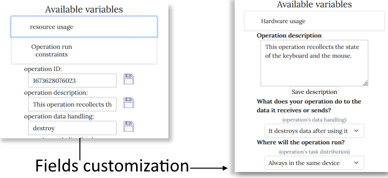
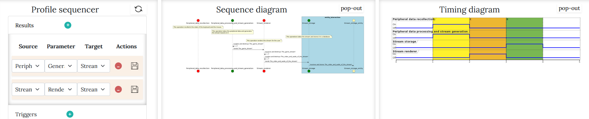
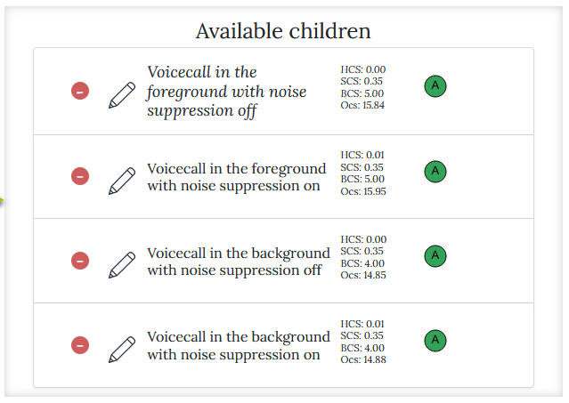
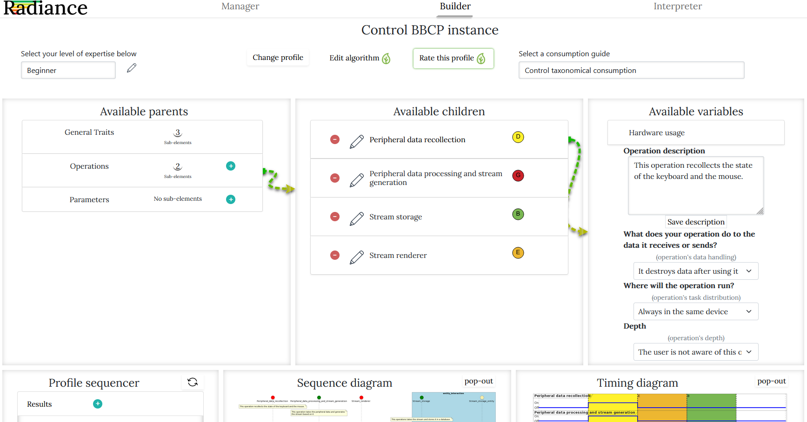

# 

# Table of contents
- [About](#about)
- [Contents](#contents)
- [Installation](#installation)
  - [Pre-requisites](#pre-requisites)
  - [Installing RADIANCE+](#installing-radiance+)
  - [Running RADIANCE+](#running-radiance+)

# About
Description: RADIANCE+: softwaRe behAvior DesIgn And eNergy Consumption assEssment

Website: http://webdiis.unizar.es/~silarri/prot/RADIANCEplus/

Topics: neat-ambience

RADIANCE+ (softwaRe behAvior DesIgn And eNergy Consumption assEssment) is a webapp tool that facilitates green software design with a model driven approach. Users can design atomic fragments of software called "profiles". Profiles use the "Behavior Based Consumption Profile (BBCP) Domain-Specific Modeling Language", a modeling language that we have created to mimic the evolution of software usage through time (we call this "diachronic software behavior"). Profiles can be later agglomerated in "collections", which can represent full applications or individual components.

There are several features in RADIANCE+ that make it unique. Some of them include:
1. RADIANCE+'s UI can be customized to meet the needs of users with different levels of expertise. There is no need to access the code of RADIANCE+ to implement such customizations, as they can be performed in the tool itself.

2. RADIANCE+ parses the profiles to generate sequence and timing diagrams that guide the user visually.

3. RADIANCE+ uses an algorithm to rate the estimated hardware resource consumption of each of the operations in a profile and labels them using a color and its respective letter.

RADIANCE+'s UI:

# Contents

- /RADIANCEplus/src        RADIANCE+'s source code
- /RADIANCEplus/Design     RADIANCE+'s Docs (WIP), development diary, notes on the rating algorithm

# Installation
## Pre-requisites
An apache server running. A bundle such as WAMP can be installed.
## Installing RADIANCE+
Download the files from /RADIANCEplus/src and place the **contents** into the folder you prefer and that Apache will recognize.
## Running RADIANCE+
Using a web browser, navigate to the folder in the previous step.

# Web page

- [http://webdiis.unizar.es/~silarri/prot/RADIANCEplus/](http://webdiis.unizar.es/~silarri/prot/RADIANCEplus/)

- [http://webdiis.unizar.es/~silarri/NEAT-AMBIENCE/](http://webdiis.unizar.es/~silarri/NEAT-AMBIENCE/)

# Logos

 

